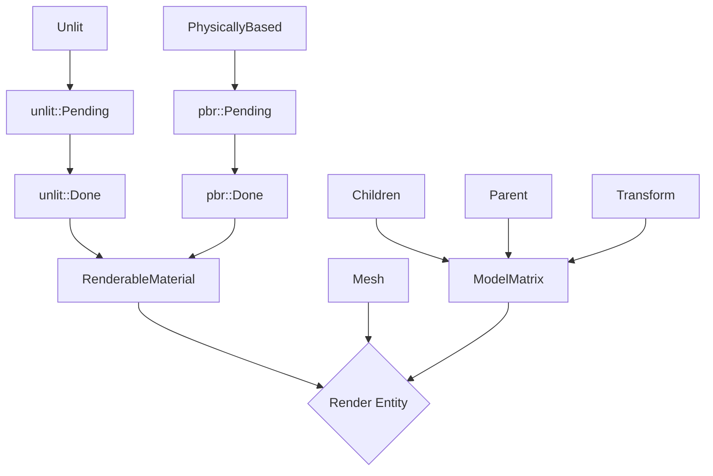

# Notes

A collection of notes collected during debugging, design of features etc. They are mainly useful to me to dump my
thoughts so that if I switch computers or take a longer break from this, I can get back on track faster. The notes
at the bottom are the most recent.

## Buffer API

There are a few design features we want to acheive with buffers:

### Mutability management

The use be able to specify if the buffer is mutable or immutable. For mutable buffers, the device
buffer should be accessible from both the gpu and cpu, persistently mapped. Furthermore, it is
double-buffered to allow modyfing data while still drawing the previous frame. An immutable buffer
is single-buffered and is uploaded via staging buffer to device-only memory which should be faster
to access. It is a runtime error to try to modify a immutable buffer. Otherwise the two should be
interchangeable. Mutable buffers should only be mutated between a next_frame() and submit_frame()
call, as we won't otherwise know which frame idx to use.

### Handle-based device buffer management

References to gpu-api managed resources are passed around with handles to ensure lifetime are
proper. E.g. that they are not destroyed before they are used on the gpu.

### Buffers are typed according to their usage

Vertex, index and uniform buffers have different types.

### Provide convenience type and ergonomic api

Provide both host-only buffers (frontend-only) for convenience of managing buffer data and allow
creating buffer descriptors from them easily.

## Debugging the blocky directional shadows

**Issue**: The directional shadow maps produce blocky shadows for small objects. This is especially visible when the
light is moving as the pixelated values flicker very cleary.

**Repro**: `cargo run -- --rsf-file data\ambient_light.ron.rsf --spawn-cube --spawn-plane`

The process of directional shadow mapping is largely: We build the bounds of what the light space is, by taking the
camera viewing volume and the scene into account. This results in an AABB in world space that we create an ortographic
projection for and render the shadow into. The shadow rendering pass is largely a matrix \* vertex for the vertex shader
and then only a depth write for the fragment. No fragment shader is run and no pixels are written.

This is then read as a texture attachment in the fragment shader for the PBR to determine if the fragment that we are
currently rendering is occluded from the light. Each vertex gets coordinates for each light it might be interacting
with, which are interpolated for the fragments. To check if a fragment is occluded, its shadow coordinates are used
to lookup the depth in the texture for that light. If its z value is larger than the depth, it means that there is
something occluding it in the direction of the light and it should be shadowed. This is used to affect the shading
of that fragment by modifying the contribution of that lights color for the final color of the pixel.

* For the plane and cube scene with a stable directional light, the plane is quite large in the shadow map (in RenderDoc)
  and the small cube doesn't really show up. This seems to indicate that the bounds are too large.
* Dumping the bounds in the UI, the bounding volumes seem to be OK? Pixel density for shadow map should be around
  33 p/m^2 which is OK? Maybe this is low?

The shadow map in render doc seems to strongly indicate that the map is too large anyhow and this is why the box shadow
is pixelated.

> One possible solution might be to exclude "the ground" from the shadow computations. It could be possible to introduce
> a "non shadow caster"/light passthrough tag that we can attach to the "ground" plane to reduce the size of the shadow
> volume. Still though, it seems large and that it should be possible to reduce it.

This is how the shadow map volume creation works:

1. Compute the bounds of the view we want to cast shadows in.

   1. Find the camera that is the shadow viewer (the loop exits after the first).
   2. Compute the view matrix (the conversion from world to camera space).
   3. Compute the OOBB of the camera (in camera space).
   4. Invert the view matrix and use it to convert the OOBB to camera space.

2. For each view, this bounding box (OOBB) is converted to the coordinate system of that light.
3. Convert the OOBB to an AABB, that is constructed in a way to minimize artifacts from lights and camera movement.
4. This AABB is used to construct the ortographic projection matrix.

Reading the Microsoft guide to shadow maps, it seems fairly likely that the problem is "perspective aliasing".

Solution: Implement Cascaded shadow maps.

## Refactor the light pass

**Issue**: The light_and_shadow_pass has a bit too many responsibilities.

It would be nice to separate the shadow passes into standalone passes that pass on their information.

Conceptually, I think this is the problem space:

### The shadow render passes

1. Find the lights that cast shadows.
2. For each of these:
   1. Compute a projection matrix. This is both used in:
      * The shadow pass vertex shader to transform the vertices and render the depth buffer.
      * The vertex shader for the main render pass to compute the shadow coords for each vertex.
   2. Update the uniform buffer for the shadow render passes
   3. Encode the shadow render pass in the command buffer. This only runs a vertex shader that computes the depths and
      then writes those to a depth buffer.

The output of the shadow render passes is effectively a list of texture and matrices that should be used in the main
render pass.

### The main lighting pass

1. Find the list of lights that affect the scene.
2. Compute PackedLight for all of these. These hold an index into the buffer of shadow matrices and shadow textures
   (NOTE: These are not the same)
3. Write PackedLight uniform
4. Bind the textures
5. Bind the shadow coords
6. Draw all entities

### Debugging the lights not showing up

The scene is dark because no light hits the objects, it seems like. Why is light not hitting the objects?

Solution: Make sure to write LightingData::n_lights.

### Debugging the shadow flickering for spot light

It seems like the matrix indices are wrong.

Solution: Well yes, they were very wrong.

### Shadow map for direction light is from incorrect angle

The shadow map for directional light looks like the light is aligned with the flat plane that is the ground.

Solution: Make sure to not forget the view matrix...

### Refactoring is done

It now works like:

1. `light::shadow_pass()`

   1. Build a buffer of view projection matrices for shadow lights.
   2. Write the buffer to the gpu with a blocking call, this is the buffer that each separate shadow pass will bind one
      instance of for the vertex shader view_proj.
   3. Encode depth-only render passes, one for each of the shadow lights, for all entities.
   4. Each of the shadow lights get a `ShadowMap` associated with it that holds indices into the shadow maps and into the
      matrices for a specific shadow pass. It also holds a `ShadowType` enum,
      so that the main rendering pass can pass that info on to the fragment shader for texture
      lookups.

2. `light::write_lighting_data`

   This function writes the `LightingData` and `ShadowData` uniforms that needs to be written before the main lit
   render pass.

3. Main render pass
   This uses the LightingData and the ShadowData to run the PBR shaders.

## Shader recompilation and failure management

Goals:

1. Bad shaders shouldn't crash the app on startup.
2. Would be nice with a CLI tool to compile all shaders in the repo
3. Live reload of shaders with manual action

### Findings

For 1 the tricky thing for this is that the dummy pipelines are part of the render initialization and there is not a good
way (currently) to handle them failing to compile graceful and still continue the rendering loop.

For 2, added `check-shaders` that runs through all shaders and compiles them, emitting errors as it goes.

For 3, The current (non-working) solution is to tag all entities that should have its material recomputed and effectively
redo the entire creation. Setting aside the buggy behaviour, this might miss shaders that are not attached to entities,
e.g. the shadow pass shaders, which won't be recompiled. A future solution might look like:

1. The UI (keybind or button) generates recompile event. It could also be coming from a file watcher.
2. This is intercepted somewhere were we have access to the renderer and we recreate all the pipelines with shaders.

This means we have to be able to recreate shaders easily.

* We'd need to register all `GraphicsPipelineDescriptors` that are used.
* We might need to `WaitDeviceIdle` before replacing all the pipelines, to ensure none are in use.
* We'd go through all the shaders (pipelines descriptors?) that are known, get the matching pipeline idx in the
  resources storage and recreate it. On subsequent uses, all rendering would use the new pipeline.
* Currently, the pipeline descriptors only accept raw spirv so we'd need to associate the shader paths with the
  pipeline descriptor.
* This would not support shaders that are not loaded from file unless we take a function that provides the source? This
  might be nice anyhow to make sure it is agnostic.
* The recompilation system could live at the start of `draw_frame` as a manual call.

Even tough the above system would be better, it is less work to get the current reload system working.

## Material reload feature not working

Problem: Neither using the 'R' key or clicking the button in the UI causes shaders to be recompiled and used for the rendering

### Findings

Turns out it is the feature that packages the shaders with the source code application that causes the issue. The
renderer doesn't load the shaders from the source directory but from the build directory, which means the changes are
not picked up unless there is a rebuild.

To give some context, this was added because using the `ram` lib from a different location would mean the shaders
weren't found, as the loading was done relative to the CWD of the executable. This was again redone recently to support
the `check-shaders` executable so that it can load shaders relative to the CWD of the executable if it is not found.

So, some goals for reworking this:

1. An executable using `ram` should always be able to execute the builtin shaders so they need to be packaged somehow.
2. This packaging should not interfere with the reload feature, i.e. the latter should still work.
3. Executables using `ram` should be able to (re-)load custom shaders.

Some ideas:

* Reloading shaders passes a parameter that forbids the use of the build-dir shaders. Instead, it would look in the CWD
  (or some user-defined path) for the shaders.
* Remove build-dir shaders. Not sure if it is possible to package this shaders in any other way. With that said, the
  current packaging feature would only work in the context of cargo but not generic packaging of an executable. For
  example, to introduce a new executable, "demo" we'd need to copy the shaders for the ram lib as well. Even if we
  added the shaders into the executable code with `include_bytes` we'd still end up having to have a "don't use builtin"
  mode when wanting to iterate on the core shaders.

Initial design: `ShaderCompiler::compile` now takes a `ShaderLocation` instead of a path, which means we can control
the lookup dirs from the caller. The idea is that the reload feature is only expected to work when working with the
ram source code close. With that, we skip using the builtins and use absolute paths.

### Solution

Went with the `ShaderLocation` which seems to work fine altough the code that builds the PBR shaders doesn't look that nice.

## Rework trekant image creation API

Goals:

1. Support cube maps
   This is needed for point lights.
2. Allow synchronous creation of images from borrowed data (for imgui)
3. Decuple Image creation from image writing and mipmap generation.
   Remove command buffer usage from backend::Image!
4. Should texture creation be done via the `ResourceManager` API?
   The problem is that this means that users have to include the ResourceManager API to actually be able to use the type
   which is not great. So, no, it should not.
5. Don't require users to use the `texture` module, all the public API should be available in `trekant`.
6. Minimize code duplication and share code with the loader.
7. Get rid of the intermediate enums in the Renderer.
   Can we reduce them in the loader?

### Current workings

* `trekant` exposes the `Texture` and `TextureDescriptor` types which form the basis of texture creation.
* Texture creation is not part of the "ResourceManager" API. IIRC, this was due to the ResouceManager API not providing
  a clear benefit.

The current texture class exposes functions to create a new texture (sampler + image + image view) in 3 ways:

1. empty/uninit
2. From Image
3. From data

Ideas:

* Splitting the data and the description is problematic if the data contains a `File` variant, as we only
  know the extents after loading the file but the description needs the extent upfront. So, we probably
  want to keep the outermost TextureDescriptor API as-is.
* We don't want to copy-paste how to load the TextureDescriptor between the loader and the renderer.
* Move out the loader code for creating a texture into a new function, load_texture.

### Solution

* The `Loader` API now exposes `load_texture` for loading textures rather than supporting
  `ResourceLoader::load` meaning that users no longer have to import the trait to use it (6).
  It also means the code is a bit simpler. Buffer are still loaded with `ResourceLoader::load`, changing
  this is out of scope for now.
* The job queuing and command buffer in the loader was simplified a bit.
* `trekant::descriptor` was renamed to `pipeline_resource` as descriptor is used as a suffix for a lot of
  "parameter struct" that bake several parameters into a struct for e.g. a constructor.
* Remove the intermediate texture enums in `Renderer` (8).
* The vk backeng image API was improved to accept a `ImageDescriptor` rather than a lot of params. Also, the usage of
  command buffers in the API was removed, meaning that only empty vk images can be created (4).
* Start working towards to taking references to vk handles for e.g. buffers.
* `TextureDescriptor::Raw` now takes a `DescriptorData` for the bytes (compared to `Arc<ByteBuffer>`)
  which means both owned and borrowed data is also supported.
* Make imgui integration use the API for creating textures from borrowed data.
* The TextureDescriptor is now only part of the public API in `trekant/src/texture`. Internally, a combination of
  `TextureDesc` and `DescriptorData` is now used (gained via `TextureDescriptor::split_desc_data`) which
  simplifies the code internally as the files are loaded early and handling empty images (where there is no data) is simpler.
  `TextureDescriptor` is still kept for the outermost API though as it quite convenient to use the `File` variant in user
  code.

## Shadow coords in fragment shaders

Currently, the shadow coord computation is all done in the vertex shader for the main lighting pass.

1. For each of the shadow casting lights, a matrix is created and written to an index withing fixed-size uniform.
2. This uniform is fed to the vertex shader for the main lighting pass, where the world position of that vertex is transformed
   into the clip-space for a shadow-casting light.
3. Each clip-space position is output as a separate vertex attribute.

This has a number of negative effects:

1. For every vertex in the scene, we compute the shadow clip coords for all lights. This will not scale if the number of
   of lights increase and we need to start culling which lights affect which areas.
2. The number of vertex attributes increase with the limit of lights. Each of these need to be interpolated etc. even if
   the light is not used.
3. The maximum amount of shadow-casting lights is hardcoded in several places: vertex shader, fragment shader and host.
4. The maximum amount of shadow-casting lights is not the same as the maximum amount of shadow maps when point lights
   are introduced, making this more complex.

Therefore, it makes sense to move the shadow coord computation to the fragment shader.

1. The world to shadow clip-space computation is done in the fragment shader rather than the vertex shader. Note that
   this means we cannot rely on the interpolation and more matrix multiplies will be done for each fragment and light.
2. World to shadow/light clip-space are written to a storage buffer that is used in the fragment shader.

While moving the shadow coord computation to the fragment shader and wanting to use storage buffers for the backing
buffer type, I noticed that there is no support for this.

While adding support for storage buffers, it the templates and macros got in the way more than it
helped. The amount of code required to just add support for storage buffers does not seems to be
worthwhile the compared to the amount of bugs it might have stopped. Maybe it is more worthwhile
in a production environment but it mostly gets in the way here :smiley:. Therefore,

1. Remove the typing of buffers (vertex, index etc.).
2. Add support for storage buffers.
3. Move shadow sampling coord computation to the fragment shader.

### Bug: The code is using the buffer offset alignment for the element alignment

Currently, the code uses the `.min_uniform_buffer_offset_alignment` for each element rather than than
only for the buffer offset itself. This is likely because the main usecase for this was the individually
bound view matrices for the shadow passes. So:

1. Shadow pass needs 256 alignment for the view matrix.
2. Main render pass needs 64 byte alignment for the world_to_shadow buffer.

Rework the buffer creation API. BufferDescriptor now exposes:

* `BufferDescriptor::vertex_buffer` and similar to make the API a bit less verbose.
  * This allows to infer the type of the buffer elemenst and put trait bounds on them, e.g. VertexDefinition.
  * Unfortunately, it also means we lose the explicitness of from_vec/from_slice etc. and this is instead inferred from
    the API. Currently, this tradeoff seems worth it but it does make the API signature hard to read and the lifetimes/allocation
    behaviour a bit harder to understand.
* `BufferDescriptor::uniform_buffer` exposes an extra parameter, `ElementAlignment::(Std140 | MinBufferOffset)` to allow
  the user to control the alignment of the elements.

### HostBuffer API

Now that the descriptor API has changed a lot, the host buffer API is harder to integrate with the buffer descriptor.

The original API for host buffers was motivated by:

> Provide both host-only buffers (frontend-only) for convenience of managing buffer data and allow
> creating buffer descriptors from them easily.

Essentially, with the loader API, we either have to:

1. Clone the buffer data `Vec` that the `BufferDescriptor` can own.
2. Move out of the `Vec` containing the data.
3. Use shared ownership with `Arc<BufferData>` so that the loader can hold on to a reference as long as it needs to.

Host buffers exist to serve `2.` and are convenient to put in components that are supposed to contain a buffer. When the
buffer descriptor is created, either the buffer needs to be cloned, or the component needs to be removed to move the
vector or the data is shared with Arc. Thus, host buffers contain an Arc.

#### Problems

* The host buffer doesn't fit into the new `vertex_buffer`, `uniform_buffer` etc. APIs as it is not typed on the element.
  There is no way to create a `BufferData` implementation for `HostBuffer` as the former has an associated type.
* The host buffer can't be made typed on the element data, then e.g. the `ram::render::Mesh` component wouldn't be able
  to exist.
* The hostbuffer type contains the trait for the buffer type. This is also used in the buffer descriptor to
  have knowledge of the required alignment for the type.
* To handle the BufferLayout arg that are required for uniform buffer descriptors, any buffer descriptor created
  from a host buffer needs to accept that. It can be made optional but the API doesn't look great.

One could consider requiring a user to pass the alignment requirement when creating the host buffer but that would mean
that the CPU buffer creation would need to "know" about how the data is laid out in the gpu buffer, which seems strange.
Also, this would break the current API with `from_vec` etc. as it would be different for uniform buffers vs. the rest.

Another more subtle problem is that with the HostBuffer API, we discard the type information and we have to store data
internally. But this is also what the buffer descriptor does. So, we have two APIs that both throw away the type and
one of them is the input of the other.

#### Solution

`BufferDescriptor::from_host_buffer` now takes an optional `BufferLayout` that is only relevant for uniform buffers.
There is no code that uses host buffers for uniform buffers though so all this work is a bit wasteful.

Also, always use `256` for the min buffer offset to simplify the code. This means we don't have to query the device
to know how to allocate. It does have the drawback of not being able to pack the uniforms as tightly but that doesn't
actually make a difference on my machine anyway.

## Bug: Opening a camera component stops the app

Opening either a Camera component in the debugger or the "Render Camera" header in the render debug
window makes the math library assert on the fov_y parameter for a function being 0.

### Findings

The code for visiting primitives in the UI would cast floats to ints and then display them as ints.
The fov_y variable which was 0.7 was truncated to 0 when it was cast to int to be displayed.

### Solution

Rewrite the UI-code to use `input_scalar` rather than `input_int` and skip all casting (thus truncation).
Also, add support for more primitive types.

## Point light shadows

Implement support for point light shadows.

1. Create the backing textures in ShadowResources.
2. Create render passes for each of the faces.
3. Render the cube maps.
4. Figure out shadow matrices, one per light?

### Sources

1. There is a sasha willems example on [omni-directional shadow mapping](https://github.com/SaschaWillems/Vulkan/blob/master/examples/shadowmappingomni/shadowmappingomni.cpp)
   with the shaders located [here](https://github.com/SaschaWillems/Vulkan/tree/master/shaders/glsl/shadowmappingomni).
2. learn opengl has a section on [point-shadows](https://learnopengl.com/Advanced-Lighting/Shadows/Point-Shadows).
3. Good blog article on cube maps in vulkan: <https://satellitnorden.wordpress.com/2018/01/23/vulkan-adventures-cube-map-tutorial/>.

### Reading the examples

Sascha Willems example uses this for the image create info:

```cpp
// 32 bit float format for higher precision
VkFormat format = VK_FORMAT_R32_SFLOAT;
// Cube map image description
VkImageCreateInfo imageCreateInfo = vks::initializers::imageCreateInfo();
imageCreateInfo.imageType = VK_IMAGE_TYPE_2D;
imageCreateInfo.format = format;
imageCreateInfo.extent = { shadowCubeMap.width, shadowCubeMap.height, 1 }; // 1024x1024
imageCreateInfo.mipLevels = 1;
imageCreateInfo.arrayLayers = 6;
imageCreateInfo.samples = VK_SAMPLE_COUNT_1_BIT;
imageCreateInfo.tiling = VK_IMAGE_TILING_OPTIMAL;
imageCreateInfo.usage = VK_IMAGE_USAGE_COLOR_ATTACHMENT_BIT | VK_IMAGE_USAGE_SAMPLED_BIT;
imageCreateInfo.sharingMode = VK_SHARING_MODE_EXCLUSIVE;
imageCreateInfo.initialLayout = VK_IMAGE_LAYOUT_UNDEFINED;
imageCreateInfo.flags = VK_IMAGE_CREATE_CUBE_COMPATIBLE_BIT;
```

from [here](https://github.com/SaschaWillems/Vulkan/blob/94198a7548d0c5b899840c31c67190df919a61a0/examples/shadowmappingomni/shadowmappingomni.cpp#L155C3-L167C63).

Image transition looks like:

```cpp
// Image barrier for optimal image (target)
VkImageSubresourceRange subresourceRange = {};
subresourceRange.aspectMask = VK_IMAGE_ASPECT_COLOR_BIT;
subresourceRange.baseMipLevel = 0;
subresourceRange.levelCount = 1;
subresourceRange.layerCount = 6;
vks::tools::setImageLayout(
    layoutCmd,
    shadowCubeMap.image,
    VK_IMAGE_LAYOUT_UNDEFINED,
    VK_IMAGE_LAYOUT_SHADER_READ_ONLY_OPTIMAL,
    subresourceRange);
```

So it seems like we should not create 6 images but rather use array layers and expose the `VK_IMAGE_CREATE_CUBE_COMPATIBLE_BIT`.

A problem seems to be the Texture abstraction in trekant. It bakes the image and the image view into one type. For cube maps,
we need a single image with array_layers = 6 and then create 6 image views from this.

WIP Solution:

1. Introduce TextureType to define if a texture is a 2D texture or a cube texture.
2. `Texture` exposes the `full_image_view() -> &vk::ImageView` and for cube maps, `sub_image_view(idx: usize) -> &vk::ImageView`
3. Introduce a new `PointlightShadow` struct to hold rendering resources for pointlight shadows (rather than using the
   generic `Shadow`)
4. Split `add_shadow_pass` into two local helper lambdas to compose better.
5. Some refactoring in how we setup shadows with `build_single_shadow`.

### Validation layer errors

`= 0x4dae5635 | Submitted command buffer expects VkImage 0x932ea900000000ac[] (subresource: aspectMask 0x2 array layer 1, mip level 0) to be in layout VK_IMAGE_LAYOUT_DEPTH_STENCIL_READ_ONLY_OPTIMAL--instead, current layout is VK_IMAGE_LAYOUT_UNDEFINED.")`

#### Solution

Turns out the sub image-views were not created with the proper `base_layer` index so all the render passes for a cubemap
were writing to the same image.

### Bug: Incorrect matrix for lightspace transformation

Issue: The 6 shadow passes each have their own view-projection matrix as they are individual faces of the cube but all
six of them are added to the output list, meaning that the main render pass samples from the first matrix.

Instead, the point light cube map sampling in the main render passes should have a matrix for the light space conversion.

### Solution

Pointlight shadows use multiple render passes, one for each face of a cube map to write single-channel color textures.
These textures are combined into a cubemap that is used in the pbr fragment shader to sample the pointlight shadow.
The reason for going with color textures rather than depth textures is that it makes the sampling calculations easier.

The 6 point light shadow passes consist of one vertex shader that:

1. Computes the world position of the vertex and writes that to frag input.
2. Computes the light-space clip position of the vertex and writes that to gl_Position.

and one fragment shader that:

Writes the length of the vector from the fragment world position to the light world position.

* This is the "depth" of the shadow, i.e. how far the light reaches in this direction.
* The length is not normalized as we are writing to a 32-bit floating point format that can handle the full range.

Each pixel in this texture is the world space depth of that fragment compared to the light source.

When sampling the fragment shader, this is required:

1. Use the vector between the light and the fragment in light-space to sample the cube map.
Likely, it should be fine to use the vector in world space as well, as the pointlight is 360
degrees and the translation does not affect vectors.
2. Compare the depth directly with the distance from the fragment to the light.

NOTE: There are still some artifacts for point lights so they are not done yet.

## BUG: Changes in #included files in shaders are not recompiled during runtime

Fixed by changing the shader loading. The framework added in (#shader-recompilation-and-failure-management) was changed
to be path-based where we setup a set of paths that the compiler should search for includes and shaders in, if the shader
path is not already absolute.

## Shader caching

GLSL to spirv compilation is now cached so that it is not redone for the same source.
The cache key is the source code string after preprocessing by shaderc. This is done to
make sure changed includes are not ignored by the caching.

The preprocess step in shaderc still shows up in the profiler but the performance has been
improved at least. To improve things further, it might be possible to resolve includes by inspecting
the source code and doing an include-lookup manually and hashing all the source code. This way, we'd
skip the source code processing. Since this wouldn't look at the defines, the defines would need to
be hashed as well.

Another feature to speed up the initial startup would be to compile to spirv at build-time but it would
be nice to improve shader compilation in general.

The file reading for shaders is not showing up in the profile so it doesn't seem like it would be valuable
to hash the filenames instead of the contents. This would also introduce the complexity of timestamps/checksums
and handling includes.

## Slow startup speedup due to texture/jpeg loading

### Findings

* Loading the gltf file takes abit more than one second:
    [2024-06-14T03:22:39Z TRACE ram::asset::gltf] gltf import took 1336.0782 ms
* There is no caching for images, we load duplicate images several times.
* Its not convenient to add caching on the async texture storage layer as the texture descriptor can contain raw data.
* It might be time to move the file-support out of trekant::TextureDescriptor and move out the dep on `image`.
* The material loading API in ram is not great as you can put a TextureDescriptor with raw data in a component.

  * Need to figure out the correct component to be in the asset-agnostic layer and work from there.
  * There likely needs to be a way for components to have a handle to raw CPU texture-data. Use `resurs`?
  * This is probably what the component should actually contain.
  * Consider splitting all the components or not at all, not the current mix of some being enums and others
    not. Might lead to some duplication but we'll see.

* gltf loading needs to be moved to another thread to not block the main one.
  Spawning a new thread is probably fine for now but ideally, we had a long-task threadpool that systems could use.
* There needs to be a caching layer for file to raw data conversion.

### Caching file -> raw image data

Start sketching out a TextureAssetLoader that contains the storage and cache for file -> raw image data.

The code is in the middle of changing texture loading. The problem is that the current Loader API - that there can only be one
instance, means that there is only one place where pending resources can be resolved. When they are flushed to the
renderer. IIRC, this was to simplify the code to not send too much data around but instead, it would be good if mapping
does not have to take effect immediately but instead be done in individual systems.

Loader API:

Start sketching an API where the loader accepts a RequesterId.

Later, a function, `Loader::flush(RequestedId) -> impl Iterator` can be called to see which of the load requests have finished.
The iterator returns proper handles that can be used in the renderer.
Could also consider `flush_buffers` and `flush_textures`.

Internally, we'll need to keep these mappings:

Request ID -> Pending handles
Pending handles -> Request ID

Make sure to reconsider the current AsyncResources class - it might not be needed.

### Solution

There were several changes introduced to improve the texture loading speed.

* A caching layer in `ram` for path -> image data. This is the `TextureAssetLoader`. Any use of a texture in a component
now needs to go through this.
* All material-related components have been re-written to have one type per material instance up until `RenderableMaterial`.
The flow is as follows:

  ```mermaid
  graph TD
      PhysicallyBased --> pbr_pending[pbr::Pending] --> pbr_done[pbr::Done]
      Unlit --> unlit_pending[unlit::Pending] --> unlit_done[unlit::Done]
      unlit_done --> RenderableMaterial
      pbr_done --> RenderableMaterial
  ```

* Rewrote the Loader API. Now, the loader takes a `LoadId` for each call to `load_*` and to `flush`.
This allows the loader to separate loads from different requesters. All loads for a specific id
will be returned (at some point in the future) from a call to `Loader::flush` for the same id.
* The above loader API changes means that the material loading could largely be moved to the `material`
module. One drawback: It depends on the `Mesh` class to know the vertex format which is needed for pipeline
creation.

## Rendering pipeline

This is the flow of component data that in the end leads to a rendered entity.

The top-level components are assigned in user code, e.g. in the `dbg` executable while the remaining
ones are computed based on the initial component data.



## Shader live reloads

### Problem

During the startup time improvements, part of the code for reloading shaders with 'R' was deleted. Specifically,
the check for `ReloadMaterial` was removed. This should be replaced with a reload of all pipeline handles that
are in use. The problem is that there is no way to know how to recreate them properly.

The ideal solution would be to have:

1. An event should trigger a recompile of the glsl shader to spirv. This could be a file-watcher or a key press.
2. The spirv shader is used to recreate the pipeline.
3. The event should support 1 shader, N shaders or ALL shaders.

Some additional constraints:

1. Changing an include file should recompile all uses as well.
2. Preferably, shader compilation should be async and parallel.
3. Support compiling from inline source?

### Investigation

The solution to this is not immediately clear to me because the current code has glsl -> spirv compilation separate from
pipeline creation. `ShaderCompiler::compile` is used to compile the glsl files to spirv. There is no record kept of the source
code of a compiled shader so it's not possible to ask it to recompile all shaders as it doesn't know that. In addition, the
code to do this is spread all over the codebase so there is no centralized location there either.

The pipeline creation is also spread out in imperative code, where the glsl -> spirv compilation is usually followed by
a call to `Renderer::create_gfx_pipeline`.

Fundamentally, when a shader is recompiled, all pipeline objects with that shader need to be recreated.

Assume the event to recompile shaders should support: 1 shader, N shaders, all shaders.

These parts are needed:

1. A system to register files to watch.
2. A systems that collects recompilation events and recompiles shaders.

### Design

1. Immediate, blocking, pipeline creation.
    * Takes a vertex shader and an optional fragment shader, defines for both etc.
    * Pipeline settings, e.g. winding order, fill mode, vertex format etc.
2. If successful, this will register the shader source, the shader compilation info and the resulting pipeline.
3. It then returns the result.
4. Async event inputs to the same registry of pipeline creation.o
5. This can be a file path, e.g. from the file watcher, or it can be ....
6. A flush API that is called once per-frame that returns newly re-created pipelines.

With this, different parts of the program can queue recompiles of a specific shader but there is a central place
that updates the pipeline storage and handles.

In addition, there is asynchronous & parallel shader compilation. The shader compilation service has a pool of threads that
wait for new jobs to show up in a job queue. The immediate API above queues shader compilation to this service and then
blocks on waiting for the result.

#### `PipelineService`

This is the top user-facing type. It exposes an API to create trekant pipelines.
The pipeline inputs are:

* Vertex shader. GLSL source path, defines for the compilation.
* Fragment shader. GLSL source path, defines for the compilation.
* PipelineSettings. E.g. winding order.

The idea is that the initial creation of a pipeline is done with this class. It will internally
register all of the inputs to be able to recreate the pipeline if any of the input shader paths
change or is explicitly asked to recompile.

Internally, the pipeline service uses the `ShaderCompilationService` to compile shaders

#### `ShaderCompilationService`

This implements multi-threaded async shader compilation. It keeps track of all the shader permutations for a certain
shader path. This is done to be able to give it a shader path and then it spawns rebuild jobs for all the permutations
for that shader path.

It exposes both an immediate and async API, corresponding to the needs to the PipelineService.

### Bugs

Notes for bugs found during development.

#### Sporadic errors in pipeline validation

The validation layers complain about a missing OpEntryPoint "main" with the correct shader stage.

The issue was that the order that you queue doesn't reflect the order that you receive results in.

Learnings:

* Turned out the best way to debug was to add some more logs and compare a good run with a bad one.
* Threaded systems have (logic) race conditions. Who would've thought?
* Let's look at reworking the blocking creation API to reduce the chance of this issue appearing in other uses
of the shader compilation API.

#### The shader permutation map is not written

This map is never modified during the blocking `create` call.

This was fixed and in turn, the shader service now exposes a blocking API for compiling several shaders.

### TODO

1. Fix the validation errors when recompiling.
2. Test the recompile functionality
3. Profiling
4. Cleanup the code

## Future work

### Fix hack with mipmap generation dependency

There is a todo in `material.rs` for fixing this. The problem is that we shouldn't create the descriptor set
before the mipmaps are generated.

### Logging in imgui UI

Would be nice to get logs in the imgui UI.

### Rewrite mesh loading to use separate components like materials

This would make the codebase more consistent.

### Shadow improvements

* Both directional lights and point lights have some artifacts w.r.t. to blocky shadows in the main pass.
* Consider switching to a single depth texture for point lights. Need to write manual (0,1) depth in the
fragment shader just like learnopengl.com for this.
* Implement cascaded shadow maps for directional lights.
* Binning/clustering for supporting many lights.

#### Directional lights improvements

Try to reproduce the scene bounds in the opengl or sascha willems examples for directional light shadows and see if the
issues with pixelated examples can be reproduced.

### Improve the imgui ECS debugger

* Show all systems.
  * Show timings.
  * Show passes?
* List all components an entity has.
* Don't crash when editing a quat.

### Multiview rendering for cubemaps

<https://www.reddit.com/r/vulkan/comments/17rhrrc/question_about_rendering_to_cubemaps/>

### ram::render::draw_frame structure

Instead of passing around the World, consider extracting all rendering info from it in one or several passes over the world.
These structures would then be used in the rest of the rendering rather than storing intermediate data in the world.

### Frame API

As far as I remember, this API was designed to ensure that frames are started and finished properly before accessing resources.
But looking at it now, it is a lot of API surface just for maintaining the frame idx. It might be more wortwhile to track
this internally in the renderer and panic if it is not done correctly. In addition, it duplicates the renderer API.

* Add assert in Renderer that mutability functions are not using if a frame is in-flight

### Buffer API

* Consider moving `elem_size` and `elem_align` into BufferDescriptor. This would reduce the contents for most of the enums.
* Consider moving the `enqueue` functions to free functions.
